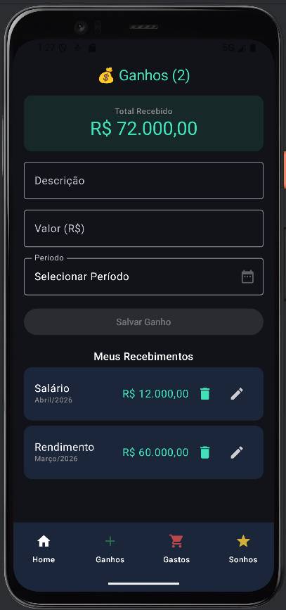
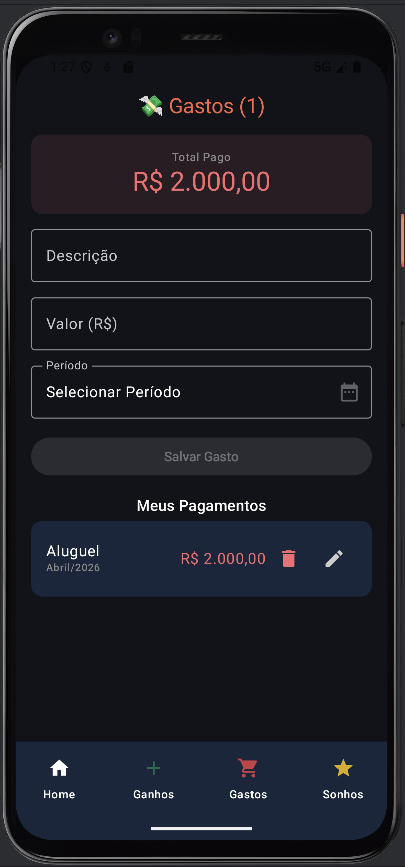
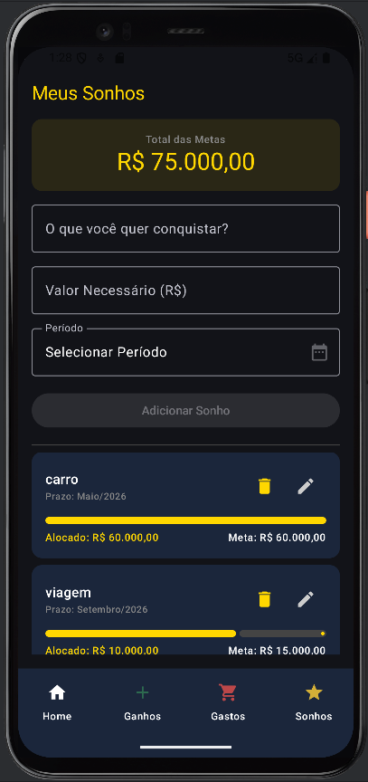

# 💰 Gestão de Despesas - Finanças Pessoais

Um aplicativo Android moderno e intuitivo para controle financeiro completo, desenvolvido com as tecnologias mais recentes do **Jetpack Compose**.

---

## 📸 Capturas de Tela

  
  
  
  

---

## ✨ Funcionalidades Principais

*   **Dashboard Inteligente**: Veja seu saldo geral, o que entrou e o que saiu de forma clara. Inclui um gráfico circular (*Donut Chart*) animado para acompanhar o progresso dos seus sonhos.
*   **Gestão de Ganhos**: Cadastre todas as suas receitas com sugestões automáticas (Salário, Bônus, Extras) e acompanhe o histórico detalhado.
*   **Controle de Gastos**: Registre suas despesas diárias com categorias sugeridas (Aluguel, Mercado, Lazer) para não perder o controle do orçamento.
*   **Planejador de Sonhos**: Defina metas financeiras de longo prazo, acompanhe quanto você já economizou e veja visualmente quão perto está de realizar seus objetivos.

---

## 🛠️ Tecnologias Utilizadas

*   **Linguagem**: Kotlin
*   **Interface (UI)**: Jetpack Compose (Modern UI Toolkit)
*   **Componentes do App**:
    *   `ViewModel` para gerenciamento de estado e lógica de negócios.
    *   `Navigation Compose` para transições suaves entre telas.
    *   `Material Design 3` para uma estética premium e moderna.
    *   `State Management` com `remember` e `mutableStateOf`.

---

## 🚀 Como Executar

1.  Clone este repositório.
2.  Abra o projeto no **Android Studio Hedgehog** (ou superior).
3.  Sincronize o Gradle.
4.  Execute em um Emulador ou dispositivo físico com API 24+.

---

**P.S.:** Todo o código-fonte deste projeto foi documentado com comentários detalhados logo acima de cada função e componente, explicando o funcionamento de cada parte para facilitar o entendimento de quem está revisando o código.

---
Desenvolvido por **Sandra Mathias**
