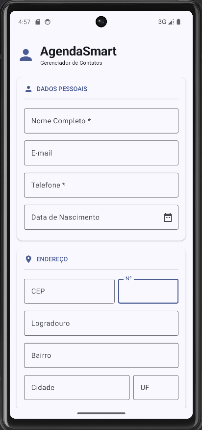
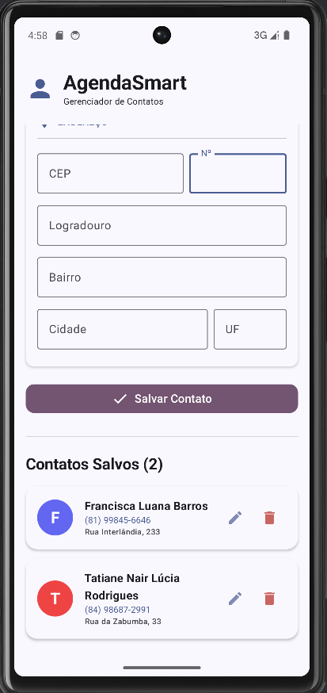
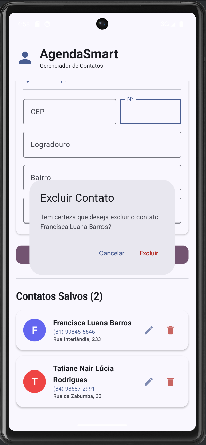
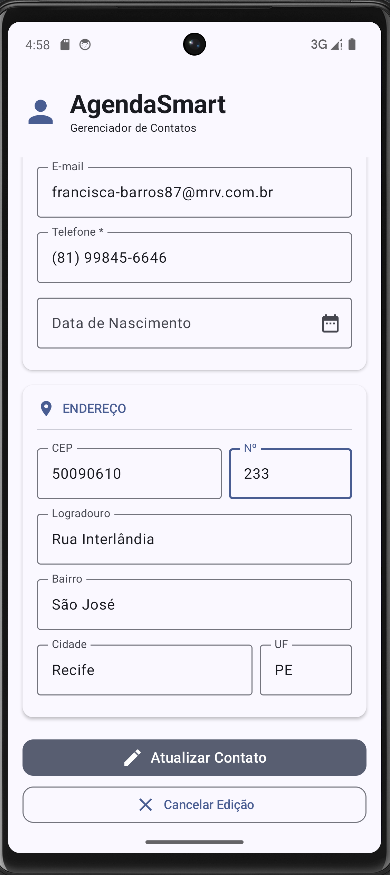
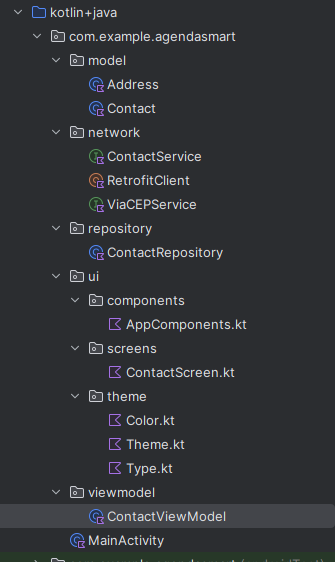

# 📒 AgendaSmart - Gerenciador de Contatos

Aplicativo Android completo para gerenciamento de contatos, desenvolvido com as tecnologias mais modernas do ecossistema **Jetpack Compose** como atividade prática do curso de Android com Kotlin.

---

## 🎓 Sobre a Atividade

Este projeto foi desenvolvido como resposta ao **Exercício: CRUD + API (Aula 45)**, cujo objetivo é colocar em prática os conceitos de:

- **CRUD completo** (Create, Read, Update, Delete) de contatos.
- **Consumo de API REST** com Retrofit.
- **Integração com API externa de CEP** (ViaCEP) para preenchimento automático de endereço.
- **Arquitetura MVVM** (Model-View-ViewModel) com Corrotinas.
- **Boas práticas** de organização e separação de responsabilidades.

---

## 📸 Capturas de Tela

  
  
  
  

  

---

## ✨ Funcionalidades Implementadas

### 📋 Requisitos do Exercício (Obrigatórios)
- **Cadastro de Contatos (Create)**: Formulário com campos para Nome, E-mail, Telefone, Data de Nascimento e Endereço completo.
- **Listagem de Contatos (Read)**: Exibição dos contatos cadastrados com avatar colorido e informações principais.
- **Edição de Contatos (Update)**: Ao clicar no ícone de lápis, os dados do contato são carregados automaticamente no formulário para edição.
- **Exclusão de Contatos (Delete)**: Remoção de contatos via ícone de lixeira.
- **Integração com API de CEP**: Ao digitar um CEP válido, os campos de Logradouro, Bairro, Cidade e UF são preenchidos automaticamente via [ViaCEP](https://viacep.com.br/).

### ⭐ Além do que foi solicitado, foram implementados:

- **📅 Calendário Nativo (Material 3 DatePicker)**: Em vez de um campo de texto simples para a data de nascimento, foi integrado o componente nativo de calendário do Material Design 3. Isso elimina a possibilidade de inserir datas inválidas (como 31/02) e, por configuração, **bloqueia automaticamente a seleção de datas futuras** — afinal, ninguém nasce no futuro.

- **📧 Validação de Formato de E-mail**: O campo de e-mail valida o formato em tempo real enquanto o usuário digita, usando o padrão `android.util.Patterns.EMAIL_ADDRESS`. Se o formato estiver incorreto (ex: faltando o `@`), o campo fica vermelho e o salvamento é bloqueado até a correção.

- **🛡️ Confirmação de Exclusão**: Para evitar exclusões acidentais, a ação de deletar um contato exibe um **AlertDialog** pedindo confirmação, com o nome do contato na mensagem, antes de enviar a requisição para a API.

- **🔤 Ordenação Alfabética Automática**: Os contatos são exibidos sempre em ordem alfabética (A-Z), independentemente da ordem em que foram cadastrados ou de letras maiúsculas/minúsculas.

- **🔢 Teclado Numérico Contextual**: Os campos de Telefone e CEP ativam automaticamente o teclado numérico do dispositivo, melhorando a experiência de preenchimento.

- **🧹 Limpeza Automática de Endereço**: Se o usuário apagar ou corrigir um CEP inválido, os campos de endereço preenchidos automaticamente (Logradouro, Bairro, Cidade, UF) são limpos de forma automática, evitando dados inconsistentes no cadastro.

- **⏳ Indicador de Carregamento no Botão**: Durante o envio de dados para a API (salvar ou atualizar), o botão de ação desativa e exibe um `CircularProgressIndicator`, impedindo cliques duplos e dando feedback visual ao usuário.

- **✏️ Botão Cancelar Edição**: Ao entrar no modo de edição de um contato, um botão "Cancelar Edição" aparece, permitindo sair do modo de edição sem salvar as alterações, com limpeza automática do formulário.

---

## 🌐 APIs Utilizadas

| API | Finalidade | URL |
|---|---|---|
| **API Própria (Node.js)** | CRUD de Contatos (Create, Read, Update, Delete) | `https://apitesteaula.onrender.com/contacts` |
| **ViaCEP** | Preenchimento automático de endereço por CEP | `https://viacep.com.br/ws/{cep}/json/` |

> A API principal foi construída em **JavaScript (Node.js)** e está hospedada no **Render**. Ela pode ser visualizada e testada diretamente pelo app ou acessando a URL acima. Os dados cadastrados no aplicativo ficam persistidos nela e podem ser consultados em tempo real.

---

## 🏗️ Arquitetura e Tecnologias

- **Linguagem**: Kotlin
- **Interface (UI)**: Jetpack Compose
- **Padrão de Arquitetura**: MVVM (Model-View-ViewModel)
- **Componentes**:
  - `ViewModel` + `Coroutines` para gerenciamento de estado e chamadas assíncronas à API.
  - `Retrofit` para comunicação com as APIs REST.
  - `Material Design 3` para componentes de UI modernos (DatePicker, AlertDialog, Snackbar, etc.).
  - `LaunchedEffect` e `remember` para gerenciamento reativo do estado da tela.

---

## 🚀 Como Executar

1. Clone este repositório e acesse a branch `projeto-agendasmart`.
2. Abra o projeto no **Android Studio Hedgehog** (ou superior).
3. Sincronize o Gradle.
4. O app requer conexão com a internet para se comunicar com a API.
5. Execute em um Emulador ou dispositivo físico com **API 24+**.

---

**P.S.:** O código-fonte está organizado seguindo a arquitetura MVVM, com comentários explicativos nas principais funções, separando claramente as responsabilidades de cada camada: **Network → Repository → ViewModel → UI**.

---
Desenvolvido por **Sandra Mathias**
